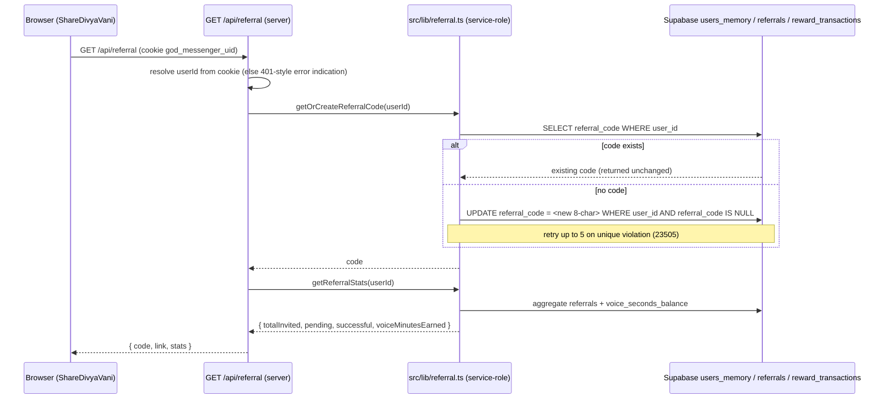

# Design Document

## Overview

The Referral_Reward_System lets an existing anonymous Divya Vani user invite another person. When the invited (Referred_User) person uses 3 free messages, the inviting (Referrer) user is credited 120 seconds (2 minutes) of free voice talk with Krishna in the existing `users_memory.voice_seconds_balance` wallet — the same wallet the live voice feature reads for entry, `/api/wallet/verify` credits, and the `consume_voice_seconds` RPC debits.

The feature threads through three existing systems without altering their contracts:

1. **Anonymous identity** — the `god_messenger_uid` HTTP-only cookie (UUID, one row per user in `users_memory` keyed by `user_id`). The referral code is stored as a new nullable column on that same row. No new user table, no login, no signup.
2. **Chat flow** — attribution is created when a new user first POSTs to `/api/chat` carrying a stored `ref` code, and qualification + crediting fire inside the existing `persistTurnState` once the referred user's `message_count` reaches 3. Both are wrapped so a referral failure can never break or block chat.
3. **Live voice wallet** — the reward is an additive credit to `voice_seconds_balance`, immediately spendable subject to the existing `VOICE_MIN_START_SECONDS = 60` entry floor.

Crediting is server-side only and idempotent, mirroring the `markPaymentVerifiedAtomic` pattern (status-guarded conditional `UPDATE ... WHERE status='pending'`) combined with two unique constraints (`referrals.referred_user_id`, `reward_transactions.related_referral_id`). This guarantees credit-once even under the known, founder-accepted double-send race where `message_count` may be read stale.

### Non-goals

- **No login or signup.** The feature operates entirely on the existing anonymous cookie identity.
- **No parallel user system.** All per-user referral state (`referral_code`) lives on the existing `users_memory` row.
- **No new voice-balance column.** Rewards credit the existing `voice_seconds_balance`. The `referrals` and `reward_transactions` tables are bookkeeping only.
- **No new free-message counter.** Qualification reads the existing `users_memory.message_count`.
- **No browser fingerprinting.** Abuse resistance uses only `user_id`, browser storage, timestamps, and server-side DB checks.
- **No migration tooling.** Schema ships as idempotent manual SQL the founder pastes into the Supabase SQL Editor.

## Architecture

All referral DB access uses the cached service-role Supabase client in a new `src/lib/referral.ts`, mirroring `src/lib/supabase.ts` (cached `getClient()`, `[referral]`-prefixed `console.error`, silent-fail returning `null`/`void`). Security-relevant reads/writes are server-only; the client never adds seconds to a wallet directly.

### (a) Get / create referral code + stats (Share UI load)



### (b) ?ref capture → localStorage → attribution on first chat POST

```mermaid
sequenceDiagram
    participant L as Landing mount (referralCapture.ts, client)
    participant LS as localStorage (divya-vani-ref:v1)
    participant C as ChatUI (client)
    participant API as POST /api/chat (server)
    participant R as src/lib/referral.ts (service-role)
    participant DB as Supabase

    L->>L: read URLSearchParams "ref"; validate 1-64 [A-Za-z0-9_-], single occurrence
    alt valid AND nothing stored
        L->>LS: store { code, stored_at } (never overwrite existing)
    else invalid or already stored
        L->>L: no-op (render continues, never blocks)
    end
    C->>LS: readStoredRef()
    C->>API: POST { message, ref? } (ref included only when present)
    API->>API: resolve cookie; if absent generate UUID, isNewUser = true
    alt isNewUser AND ref present
        API->>R: attributeReferral({ referrerCode: ref, referredUserId: userId })
        R->>DB: validate code → referrer; guards (self / pre-existing / one-per-referred); INSERT pending
    end
    API-->>C: chat reply (success independent of referral outcome)
    C->>LS: clearStoredRef() (attribution attempted once)
```

### (c) Qualification + credit at message_count >= 3 (inside persistTurnState)

```mermaid
sequenceDiagram
    participant API as persistTurnState (server, waitUntil/awaited)
    participant SM as saveMemory (users_memory)
    participant R as src/lib/referral.ts (service-role)
    participant DB as Supabase referrals / users_memory / reward_transactions

    API->>SM: saveMemory(userId, { message_count: nextMessageCount, ... })
    alt onFreePool AND nextMessageCount >= 3
        API->>R: qualifyAndCreditReferral(userId)
        R->>DB: UPDATE referrals SET status='qualified', qualified_at=now, referred_message_count_at_qualification=N WHERE referred_user_id=userId AND status='pending' RETURNING *
        alt row returned (transitioned)
            R->>DB: INSERT reward_transactions (related_referral_id UNIQUE)
            R->>DB: increment referrer voice_seconds_balance by 120 (atomic RPC)
        else NULL/empty (already qualified or absent)
            R->>R: skip crediting (idempotent no-op)
        end
    end
    Note over API,R: entire block in try/catch; failure never breaks chat
```

### (d) Stats fetch (Share UI status display)

```mermaid
sequenceDiagram
    participant U as Browser (ShareDivyaVani)
    participant API as GET /api/referral (server)
    participant R as src/lib/referral.ts
    participant DB as Supabase

    U->>API: GET /api/referral
    API->>R: getReferralStats(userId)
    R->>DB: COUNT referrals by status WHERE referrer_user_id; SUM via voice reward txns
    R-->>API: { totalInvited, pending, successful, voiceMinutesEarned }
    API-->>U: stats (all values server-computed; client never computes rewards)
    Note over U: if no response within 10s → error indication, no partial values
```

## Components and Interfaces

### `src/lib/referral.ts` (server, service-role, silent-fail)

Follows the `src/lib/supabase.ts` pattern exactly: a module-local cached service-role client, `[referral]`-prefixed `console.error`, `try/catch` on every DB op. Security-relevant operations fail closed (return a non-credit / invalid result on error).

```typescript
export type ReferralStatus = "pending" | "qualified" | "rejected";

export interface ReferralRow {
  id: string;
  referrer_user_id: string;
  referred_user_id: string;
  referral_code: string;
  status: ReferralStatus;
  required_messages: number;          // default 3
  reward_seconds: number;             // default 120
  referred_message_count_at_qualification: number | null;
  created_at: string;
  qualified_at: string | null;
  rejected_reason: string | null;
}

export interface ReferralStats {
  totalInvited: number;
  pending: number;
  successful: number;       // qualified count
  voiceMinutesEarned: number;  // integer division of earned seconds by 60
}

export interface ReferralIdentity {
  code: string;
  link: string;             // https://divyavani.co.in?ref=<code>
}

/**
 * Returns the stable Referral_Code for userId, generating + persisting one on
 * first request. Generation: 8 chars from [A-Za-z0-9_-], retry up to 5 on
 * unique violation. The persist UPDATE is guarded `WHERE referral_code IS NULL`
 * so a concurrent generation cannot overwrite an already-set code (stability).
 * Returns null on unresolved identity or persistent failure (fail closed).
 */
export async function getOrCreateReferralCode(userId: string): Promise<string | null>;

/**
 * Reports whether `code` maps to an existing Referrer. Read-only; never
 * creates or modifies a record. Returns false on error (fail closed).
 */
export async function validateReferralCode(code: string): Promise<boolean>;

export type AttributionOutcome =
  | { result: "created"; referral: ReferralRow }
  | { result: "rejected"; reason: string }       // self-referral, pre-existing user, invalid code
  | { result: "exists" }                          // referred_user_id already attributed
  | { result: "noop" };                           // code absent/unresolved or error (silent)

/**
 * Creates a Pending_Referral linking the code owner (Referrer) to referredUserId.
 * Guards, all enforced server-side:
 *   - self-referral: code owner === referredUserId → rejected (records rejected row w/ reason)
 *   - invalid code: no owner → noop (no record)
 *   - pre-existing user: referredUserId's users_memory row predates the stored
 *     ref timestamp (or already has message_count > 0 before attribution) → not attributed
 *   - one-per-referred: UNIQUE(referred_user_id) → second attempt returns "exists"
 * Never throws; returns "noop" on any DB error so chat continues.
 */
export async function attributeReferral(args: {
  referrerCode: string;
  referredUserId: string;
  refStoredAt?: string;   // ISO timestamp from browser storage, for pre-existing-user guard
}): Promise<AttributionOutcome>;

/**
 * Atomic, status-guarded qualification + credit for referredUserId's pending
 * referral. Mirrors markPaymentVerifiedAtomic:
 *   UPDATE referrals SET status='qualified', qualified_at=now,
 *     referred_message_count_at_qualification=N
 *   WHERE referred_user_id=$1 AND status='pending' RETURNING *
 * A NULL/empty return means already qualified or absent → skip crediting.
 * On a successful transition: INSERT reward_transactions (UNIQUE related_referral_id)
 * then increment the Referrer's voice_seconds_balance by exactly reward_seconds (120)
 * via an atomic RPC. Credits at most once. Returns the credited referral or null.
 */
export async function qualifyAndCreditReferral(referredUserId: string): Promise<ReferralRow | null>;

/**
 * Server-computed stats for the Referrer userId. Reads referrals counts by
 * status and earned reward seconds; voiceMinutesEarned = floor(earnedSeconds/60).
 * Returns null on error (route surfaces an error indication; no partial values).
 */
export async function getReferralStats(userId: string): Promise<ReferralStats | null>;
```

### `src/lib/referralCapture.ts` (client, silent-fail)

Mirrors `src/lib/chatStorage.ts` / `src/lib/voiceTranscriptStorage.ts`: `typeof window` guard, `try/catch`, never throws. Runs on landing/page mount without blocking render.

```typescript
const REF_STORAGE_KEY = "divya-vani-ref:v1";
const REF_FORMAT = /^[A-Za-z0-9_-]{1,64}$/;

export interface StoredRef {
  code: string;
  stored_at: string;   // ISO timestamp
}

/**
 * On app load: read URLSearchParams "ref". If valid (single occurrence,
 * 1-64 chars [A-Za-z0-9_-]) AND nothing already stored, persist
 * { code, stored_at }. Never overwrites an existing stored value. Invalid or
 * duplicate ref → no-op. Never throws; never blocks render.
 */
export function captureRefFromUrl(): void;

/** Returns the stored ref, or null if absent/invalid/unavailable. */
export function readStoredRef(): StoredRef | null;

/** Clears the stored ref once attribution has been attempted. */
export function clearStoredRef(): void;
```

### `/api/referral` route (`src/app/api/referral/route.ts`, server)

- **GET** → resolves `userId` from the `god_messenger_uid` cookie. If no identity, returns an error indication (does not generate a code). Otherwise calls `getOrCreateReferralCode` + `getReferralStats` and returns:
  ```typescript
  { code: string; link: string; stats: ReferralStats }
  ```
  Satisfies Req 1.1, 1.2, 1.6, 7.1, 7.2, 7.10, 9.1, 9.4.
- **POST `/api/referral/validate`** (optional, capture-time validation) → `{ code }` body → `{ valid: boolean }` via `validateReferralCode`. Read-only. Satisfies Req 7.3, 7.4, 3.5.

Attribution is **not** a standalone POST in the primary design; it is folded into the chat POST (below) to avoid an extra round trip. A `POST /api/referral/attribute` remains a documented seam if attribution ever needs to be decoupled.

### Chat-route integration seam (`src/app/api/chat/route.ts`)

Two minimal, isolated hooks (detailed in "Chat-flow integration" below), each wrapped in `try/catch` so chat never breaks:

- **Attribution** when `isNewUser === true` and the POST body carries a `ref` string: `await attributeReferral({ referrerCode: ref, referredUserId: userId, refStoredAt })`.
- **Qualification** inside `persistTurnState`, after the `saveMemory` write, when `onFreePool && nextMessageCount >= 3`: `await qualifyAndCreditReferral(userId)`.

The chat request body type widens from `{ message }` to `{ message, ref?: string }`.

### `src/app/components/ShareDivyaVani.tsx` (client)

A new component surfaced from the chat header (near the existing Settings gear) and/or `/settings`. On mount it `fetch`es `GET /api/referral` and renders:

- The Referral_Link (selectable text) when available; Copy / WhatsApp / native-share controls disabled while it is unavailable.
- **Copy** control → Clipboard API; on success shows "Your invite link has been copied." within 1s, visible 3s; on failure shows an error indication and keeps the link selectable for manual copy.
- **WhatsApp** control → opens `https://wa.me/?text=<encoded invite text + link>`.
- **Native share** control → `navigator.share` (feature-detected; the control is omitted entirely when `navigator.share` is absent).
- **Reward explanation** — title "Share Divya Vani"; description "Share Divya Vani with someone who may need peace, guidance, or Krishna's wisdom. When they use 3 free messages, you receive 2 minutes of free voice talk with Krishna."
- **Stats** — total invited, pending, successful, total free voice minutes earned (all from the API; never client-computed).
- **Earned message** — when earned seconds > 0: "You earned 2 free voice minutes because someone used Divya Vani through your invite."
- If the stats request fails or does not respond within 10s → error indication, no partial/client-computed values.

Styling uses the Dawn Aarti design system: semantic CSS vars in `src/app/globals.css` (`--color-mist`, `--color-peach`, `--color-rose`, `--color-gold-leaf`, `--color-vermillion`, `--color-ink`), fonts Marcellus / Cormorant Garamond italic / Tiro Devanagari, CSS-only motion with a `prefers-reduced-motion` off-switch, mobile-first at 360px. Copy strings are English (admin/settings surfaces are English-only per project i18n).

## Data Models

All schema ships as idempotent manual SQL the founder pastes into the Supabase SQL Editor. Re-running produces no errors and no duplicates. No new voice-balance column and no new free-message column — the reward credits the existing `users_memory.voice_seconds_balance` and qualification reads the existing `users_memory.message_count`.

```sql
-- 1. Referral code on the existing users_memory row (nullable; UNIQUE allows
--    multiple NULLs but rejects duplicate non-NULL values).
ALTER TABLE users_memory
  ADD COLUMN IF NOT EXISTS referral_code text;

CREATE UNIQUE INDEX IF NOT EXISTS users_memory_referral_code_key
  ON users_memory (referral_code);

-- 2. Referrals table — one row per referred user (UNIQUE referred_user_id).
CREATE TABLE IF NOT EXISTS referrals (
  id uuid PRIMARY KEY DEFAULT gen_random_uuid(),
  referrer_user_id text NOT NULL,
  referred_user_id text NOT NULL,
  referral_code text NOT NULL,
  status text NOT NULL DEFAULT 'pending'
    CHECK (status IN ('pending', 'qualified', 'rejected')),
  required_messages int NOT NULL DEFAULT 3,
  reward_seconds int NOT NULL DEFAULT 120,
  referred_message_count_at_qualification int,
  created_at timestamptz NOT NULL DEFAULT now(),
  qualified_at timestamptz,
  rejected_reason text
);

CREATE UNIQUE INDEX IF NOT EXISTS referrals_referred_user_id_key
  ON referrals (referred_user_id);
CREATE INDEX IF NOT EXISTS idx_referrals_referrer_user_id
  ON referrals (referrer_user_id);
CREATE INDEX IF NOT EXISTS idx_referrals_referred_user_id
  ON referrals (referred_user_id);

-- 3. Reward transactions — one row per credited referral (UNIQUE related_referral_id).
CREATE TABLE IF NOT EXISTS reward_transactions (
  id uuid PRIMARY KEY DEFAULT gen_random_uuid(),
  user_id text NOT NULL,
  type text NOT NULL DEFAULT 'referral_voice_reward',
  amount_seconds int NOT NULL DEFAULT 120,
  related_referral_id uuid,
  created_at timestamptz NOT NULL DEFAULT now()
);

CREATE UNIQUE INDEX IF NOT EXISTS reward_transactions_related_referral_id_key
  ON reward_transactions (related_referral_id);
CREATE INDEX IF NOT EXISTS idx_reward_transactions_user_id
  ON reward_transactions (user_id);

-- 4. RLS on, zero policies (service-role bypasses; key is server-only).
ALTER TABLE referrals ENABLE ROW LEVEL SECURITY;
ALTER TABLE reward_transactions ENABLE ROW LEVEL SECURITY;

-- 5. Atomic, row-locked credit of the existing voice wallet (floored at the
--    column's allowed range). Mirrors credit_seva_balance / consume_voice_seconds.
CREATE OR REPLACE FUNCTION credit_voice_seconds(p_user_id text, p_amount int)
RETURNS int
LANGUAGE plpgsql
AS $$
DECLARE
  new_balance int;
BEGIN
  UPDATE users_memory
  SET voice_seconds_balance =
        LEAST(999999999, GREATEST(0, COALESCE(voice_seconds_balance, 0) + p_amount)),
      updated_at = now()
  WHERE user_id = p_user_id
  RETURNING voice_seconds_balance INTO new_balance;
  RETURN new_balance;
END;
$$;
```

**Reused existing columns (no duplicates added):**

| Column | Table | Role in this feature |
|---|---|---|
| `voice_seconds_balance` | `users_memory` | Reward credited here (additive, no expiry), integer 0–999,999,999 |
| `message_count` | `users_memory` | Free_Message_Count source for the 3-message qualification threshold |
| `user_id` | `users_memory` | Anonymous identity for both referrer and referred |

## Chat-flow integration

The chat route (`src/app/api/chat/route.ts`) already resolves identity and increments `message_count`. The referral feature adds two surgical hooks, each fully isolated and silent-failing.

**1. Attribution (first message of a new user).** On entry the route reads the cookie; if absent it generates `randomUUID()` and sets `isNewUser = true`. The client includes the stored ref code in the first POST body (`{ message, ref }`). Around `persistTurnState` (before or alongside it):

```typescript
if (isNewUser && typeof body.ref === "string" && body.ref.length > 0) {
  try {
    await attributeReferral({
      referrerCode: body.ref,
      referredUserId: userId,
      refStoredAt: typeof body.refStoredAt === "string" ? body.refStoredAt : undefined,
    });
  } catch (e) {
    console.error("[referral] attribution hook threw:", e);
  }
}
```

The pre-existing-user guard (Req 8.5) is enforced server-side: attribution is skipped when the resolved user already has chat activity predating the stored ref (`users_memory.message_count > 0` at attribution time, and/or the row's creation predates `refStoredAt`). Because attribution runs only when `isNewUser` is true, the common path is already a fresh identity.

**2. Qualification (message_count reaches 3).** `persistTurnState(replyText)` computes `const nextMessageCount = onFreePool ? priorCount + 1 : undefined` and calls `saveMemory(userId, { message_count: nextMessageCount, ... })`. Immediately after that write:

```typescript
if (onFreePool && typeof nextMessageCount === "number" && nextMessageCount >= 3) {
  try {
    await qualifyAndCreditReferral(userId);
  } catch (e) {
    console.error("[referral] qualification hook threw:", e);
  }
}
```

`persistTurnState` runs fire-and-forget via `waitUntil(...)` in the streaming/NDJSON path and is awaited in the non-streaming path; both already sit inside the route's error handling. The known, founder-accepted double-send race can read a stale `message_count`, so qualification may be attempted more than once (or with N >= 3 repeatedly). The status-guarded atomic `UPDATE ... WHERE status='pending'` plus `UNIQUE(reward_transactions.related_referral_id)` make repeated/concurrent attempts credit **at most once** — the race is tolerated, never double-credited.

`withCookie(res, isNewUser, userId)` continues to set the cookie for new users unchanged. The chat response is produced and returned regardless of either hook's outcome.

## Anti-abuse and idempotency

| Requirement | Threat | Enforcement mechanism |
|---|---|---|
| 4.2, 7.6, 8.1 | Self-referral | `attributeReferral` rejects when code owner `user_id === referredUserId`; records a `rejected` row with `rejected_reason='self_referral'`; no pending referral |
| 4.3, 4.4, 8.2, 8.3 | One referrer per referred user / duplicate attribution | `CREATE UNIQUE INDEX referrals_referred_user_id_key`; a second attribution returns `exists`, existing row retained unchanged |
| 4.7, 8.7 | Concurrent attribution for same referred user | Same UNIQUE constraint → exactly one row persists; the loser's INSERT hits `23505` and is swallowed |
| 5.3, 5.5, 8.4, 8.8, 10.5 | Double / concurrent reward credit | Status-guarded atomic `UPDATE ... WHERE status='pending' RETURNING *` (only one transition wins) **plus** `UNIQUE(reward_transactions.related_referral_id)`; NULL return → skip credit |
| 4.5, 8.5 | Pre-existing user attributed retroactively | Timestamp guard: attribution skipped when the user's row/activity predates `refStoredAt`, or `message_count > 0` at attribution time |
| 4.6, 7.4, 8.6 | Invalid / unknown code | `validateReferralCode` returns false → no record created, normal usage continues, no error surfaced |
| 3.2, 8.3 | Re-supplied code overwriting attribution | Client storage never overwrites an existing stored ref; server `UNIQUE(referred_user_id)` keeps the first association |
| 1.3, 1.7 | Code collision | `UNIQUE(users_memory.referral_code)`; generation retries up to 5 on `23505`, else returns error indication |
| 8.9, 8.10 | Invasive tracking | Attribution/eligibility use only `user_id`, browser storage, timestamps, server DB checks; no fingerprinting |
| 8.11 | Auditability without PII leakage | Each attribution/qualification outcome logged with outcome + `user_id`, excluding chat content and PII |
| 5.7, 7.11 | Client-side wallet manipulation | No client-accessible operation adds seconds; all reads/writes server-side via service-role |

## Correctness Properties

*A property is a characteristic or behavior that should hold true across all valid executions of a system — essentially, a formal statement about what the system should do. Properties serve as the bridge between human-readable specifications and machine-verifiable correctness guarantees.*

### Property 1: A referral is credited at most once

*For any* referral and any number of qualification attempts (including repeated and concurrent attempts at or above the threshold), the system credits the Referrer's wallet for that referral at most once and records at most one `reward_transactions` row whose `related_referral_id` is that referral.

**Validates: Requirements 5.5, 8.4, 8.7, 8.8, 10.5**

### Property 2: Qualification credits exactly 120 seconds, additively and clamped

*For any* pending referral whose Referrer has prior `voice_seconds_balance` B, the first successful qualification sets the new balance to `min(999999999, B + 120)` — adding exactly the reward (never overwriting) and keeping the value within the 0–999,999,999 range.

**Validates: Requirements 5.3, 10.1, 10.4**

### Property 3: No referral is a self-referral

*For any* attribution attempt where the referral code owner's `user_id` equals the `referred_user_id`, no `pending` referral is created; the result is a rejection (recorded with a self-referral reason).

**Validates: Requirements 4.2, 7.6, 8.1**

### Property 4: Each referred user appears in at most one referrals row

*For any* `referred_user_id` and any sequence of attribution attempts (including concurrent ones, with same or different codes), at most one `referrals` row exists for that `referred_user_id`, and the first-persisted association is retained unchanged.

**Validates: Requirements 4.3, 4.4, 4.7, 8.2, 8.3**

### Property 5: reward_transactions.related_referral_id is unique

*For any* set of crediting operations, no two `reward_transactions` rows share the same non-null `related_referral_id`.

**Validates: Requirements 6.7, 8.4**

### Property 6: Crediting happens iff message_count >= 3 and the referral was pending

*For any* referral and any Referred_User `message_count` value, the referral transitions to `qualified` and credits the Referrer if and only if the Referred_User's `message_count` is at least 3 and the referral was in `pending` status at that time; for counts below 3 the referral stays `pending` and no seconds are credited.

**Validates: Requirements 5.2, 5.4, 7.9**

### Property 7: Referral code is unique and stable per user_id

*For any* user, the code returned is always exactly 8 characters from `[A-Za-z0-9_-]`, repeated requests for the same user return the same code without mutation, the corresponding link is `https://divyavani.co.in?ref=<code>`, and no two distinct `user_id`s ever hold the same code.

**Validates: Requirements 1.2, 1.3, 1.5, 1.6**

### Property 8: Invalid or re-supplied ref never overwrites an existing attribution

*For any* stored referral state and any incoming ref value, an invalid or unknown ref creates no referral record and leaves any existing stored ref / persisted attribution unchanged; a re-supplied valid ref likewise never overwrites an existing stored ref or an existing `referred_user_id` association.

**Validates: Requirements 3.2, 3.3, 4.6, 8.3, 8.6**

### Property 9: Chat response success is independent of referral operation success

*For any* outcome of the attribution or qualification hook (success, no-op, failure, or thrown error), the chat flow still produces and returns its response without interruption.

**Validates: Requirements 4.8, 5.8, 7.12**

### Property 10: Referral stats equal the true server-side aggregates

*For any* set of referrals and reward transactions belonging to a Referrer, `getReferralStats` returns `totalInvited` = count of that Referrer's referrals, `pending` = count in `pending`, `successful` = count in `qualified`, and `voiceMinutesEarned` = integer division of earned reward seconds by 60 — all computed server-side.

**Validates: Requirements 7.10, 9.1, 9.3, 9.4**

## Error Handling

The system inherits the project's silent-fail-on-Supabase-error principle: chat must never break because of referral logic.

- **All referral DB operations silent-fail.** Every function in `src/lib/referral.ts` wraps its Supabase calls in `try/catch`, logs with a `[referral]` prefix, and returns a safe value (`null` / `noop` / `false`) on error — mirroring `src/lib/supabase.ts`. A missing table or misconfigured RLS degrades the feature, never the chat.
- **Fail closed where security-relevant.** On any error, the system never grants a reward and never reports an invalid code as valid: `validateReferralCode` returns `false` on error, `qualifyAndCreditReferral` returns `null` (no credit), and `getOrCreateReferralCode` returns `null` rather than a guessed/unpersisted code (Req 1.8, 8.6).
- **Crediting is all-or-nothing.** Qualification only credits after the status-guarded `UPDATE` transitions the row; if the reward-transaction insert or wallet credit fails, the referral is left recoverable and no partial seconds are applied (Req 5.8, 10.6). The `UNIQUE(related_referral_id)` constraint prevents a retried credit from double-applying.
- **Chat hooks are isolated.** The attribution and qualification calls in `route.ts` / `persistTurnState` sit in their own `try/catch` inside the existing `waitUntil` / awaited paths, so a referral failure or throw cannot affect the streamed or non-streamed chat response (Req 4.8, 5.8, 7.12).
- **Client capture silent-fails.** `src/lib/referralCapture.ts` guards on `typeof window`, wraps all storage access in `try/catch`, and never throws or blocks render; invalid `ref` values are ignored and prior storage is preserved (Req 3.3, 3.4).
- **Stats fetch failure surfaces cleanly.** `ShareDivyaVani` shows an error indication on fetch failure or a >10s non-response and never renders partial or client-computed reward values (Req 9.5).
- **Code generation exhaustion.** After 5 colliding generation attempts, `getOrCreateReferralCode` returns an error indication rather than persisting a non-unique code (Req 1.7).

## Testing Strategy

The project uses `node:test` (see `src/lib/__tests__/`). The feature uses a dual approach: example/edge-case unit tests for concrete scenarios and a property-based testing library for the universal properties P1–P10.

### Property-based tests

PBT applies here because the core logic is pure/server-side with universal invariants (idempotent crediting, uniqueness, aggregation). Use a property-based testing library for the target language (e.g. `fast-check` with `node:test`) — do not hand-roll PBT. Each property test runs a minimum of 100 iterations and is tagged with a comment referencing its design property:

`// Feature: referral-reward-system, Property {number}: {property_text}`

Mapping (one property-based test per property):

- **Property 1 — credited at most once:** drive a referral past threshold, then call `qualifyAndCreditReferral` repeatedly and concurrently; assert total wallet delta is exactly 120 and exactly one `reward_transactions` row.
- **Property 2 — exactly +120 additive/clamped:** for arbitrary prior balances (including near the cap), assert new balance `== min(999999999, B + 120)`.
- **Property 3 — no self-referral:** for any user, attributing their own code to themselves never creates a pending row.
- **Property 4 — one row per referred user:** repeated/concurrent attribution for one `referred_user_id` yields exactly one row, unchanged.
- **Property 5 — unique related_referral_id:** across arbitrary crediting sequences, no two reward rows share a `related_referral_id`.
- **Property 6 — credit iff count>=3 and pending:** for counts 0,1,2 assert pending + no credit; for counts >=3 assert qualified + credited (once).
- **Property 7 — code unique and stable:** generate many users; assert 8-char URL-safe format, repeat-call stability, correct link, cross-user uniqueness.
- **Property 8 — no overwrite of attribution:** for arbitrary stored states and invalid/re-supplied refs, assert storage and persisted association unchanged.
- **Property 9 — chat independence:** inject every referral outcome (incl. thrown error); assert the chat reply is still produced.
- **Property 10 — stats correctness:** for arbitrary referral/transaction sets, assert `getReferralStats` matches a reference aggregation and `voiceMinutesEarned == floor(earnedSeconds/60)`.

### Unit tests (examples and edge cases)

- **Code generation collision/exhaustion (1.7):** stub the RNG to collide then succeed (assert retry), and to collide 5× (assert error indication).
- **No identity (1.9):** `GET /api/referral` without a cookie returns an error indication and no code.
- **Credit failure rollback (5.8, 10.6):** inject a failure at the reward-transaction insert / wallet credit; assert no balance change and the referral remains pending.
- **Stats fetch failure/timeout (9.5):** mock a failing and a >10s-slow API; assert error indication, no partial values.
- **Share_UI rendering (2.1–2.10, 9.2):** render with/without an available link and with/without `navigator.share`; assert controls are present/disabled/omitted, the copy-success message ("Your invite link has been copied.") appears within 1s and persists 3s, and the earned message ("You earned 2 free voice minutes because someone used Divya Vani through your invite.") shows when earned seconds > 0.

### Integration / smoke tests (not PBT)

- **Schema idempotency (6.8):** run the manual SQL twice against a test database; assert no error and no duplicate columns/tables/constraints, and that RLS is enabled with zero policies on `referrals` and `reward_transactions`.
- **Server-only crediting (5.7, 7.11):** confirm no client-accessible route mutates `voice_seconds_balance`; all referral reads/writes go through the service-role client.
- **No expiry/decay (10.3):** confirm there is no time-based reset path on the wallet.
